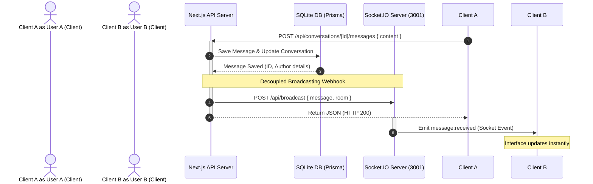

# Nexora — Premium Real-Time Chat & AI Workspace

Nexora is a high-fidelity, real-time messaging application and SaaS collaborative workspace. It integrates real-time peer-to-peer chat, online presence tracking, typing indicators, and a built-in Google Gemini AI assistant. 

Built using **Next.js 16 (Turbopack)**, **React 19**, **Tailwind CSS v4 (CSS-first config)**, **Socket.IO**, **Zustand**, and **Prisma** with **SQLite**.

---

## 🚀 Completed Milestones

### Milestone 1 & 2: Project Initialization & Custom Design System
- **Next.js 16 + React 19 + TypeScript**: Configured with strict compiler rules.
- **Tailwind CSS v4**: CSS-first configuration using CSS variables for theme flexibility.
- **Custom Design Tokens**: A custom-tailored warm palette (amber/orange/neutral tones) supporting light and dark modes via `next-themes`.
- **shadcn/ui Customizations**: Configured 13 custom primitives (buttons, inputs, cards, avatars, dropdowns, tooltips, dialogs) styled to fit a clean, modern aesthetic.
- **Typography**: Poppins (headings), Inter (body), and Geist Mono (code).

### Milestone 3: Database & Authentication
- **Prisma Integration**: Extended database mapping with a relational SQLite schema for users, sessions, accounts, conversations, and messages.
- **Prisma Client Singleton**: Implemented a singleton wrapper at [prisma/schema.prisma](file:///c:/Users/DELL/OneDrive/Documents/Desktop/Resume_project/chat-application/prisma/schema.prisma) and [src/lib/prisma.ts](file:///c:/Users/DELL/OneDrive/Documents/Desktop/Resume_project/chat-application/src/lib/prisma.ts) to prevent connection pool exhaustion during Next.js Hot Module Reloads (HMR).
- **NextAuth.js Integration**: Multi-provider authentication configuration in [src/app/api/auth/[...nextauth]/route.ts](file:///c:/Users/DELL/OneDrive/Documents/Desktop/Resume_project/chat-application/src/app/api/auth/%5B...nextauth%5D/route.ts) supporting:
  - **Google OAuth**: For secure, production-grade social logins.
  - **Development Credentials**: Allows passwordless sign-ins during development (creating or fetching mock database profiles immediately).
- **Idempotent Data Seeding**: A seed script in [prisma/seed.ts](file:///c:/Users/DELL/OneDrive/Documents/Desktop/Resume_project/chat-application/prisma/seed.ts) to populate the database with test profiles (`admin@nexora.dev` and `demo@nexora.dev`) and sample conversation histories.

### Milestone 4: Real-Time Messaging & Gemini AI Integration
- **Real-Time WebSockets Engine**: Designed a decoupled Socket.IO server at [socket-server/server.ts](file:///c:/Users/DELL/OneDrive/Documents/Desktop/Resume_project/chat-application/socket-server/server.ts) listening on port `3001` that manages rooms, online updates, and typing chimes.
- **Decoupled Broadcasting Webhook**: Implemented a non-blocking webhook POST channel in [src/app/api/conversations/[id]/messages/route.ts](file:///c:/Users/DELL/OneDrive/Documents/Desktop/Resume_project/chat-application/src/app/api/conversations/%5Bid%5D/messages/route.ts) allowing Next.js API routes to trigger real-time socket events instantly.
- **State Management (Zustand)**: A centralized store at [src/store/use-chat-store.ts](file:///c:/Users/DELL/OneDrive/Documents/Desktop/Resume_project/chat-application/src/store/use-chat-store.ts) handling conversations list sorting, active channels, message feeds, and optimistic rendering.
- **Socket Provider Context**: Developed [src/components/socket-provider.tsx](file:///c:/Users/DELL/OneDrive/Documents/Desktop/Resume_project/chat-application/src/components/socket-provider.tsx) to map connection status, list online users, track typing triggers, and bind listener hooks cleanly to the React component tree.
- **Google Gemini AI Integration**: A wrapper in [src/lib/gemini.ts](file:///c:/Users/DELL/OneDrive/Documents/Desktop/Resume_project/chat-application/src/lib/gemini.ts) utilizing the official `@google/generative-ai` SDK supporting:
  - **AI Companion Page** ([src/app/(dashboard)/ai/page.tsx](file:///c:/Users/DELL/OneDrive/Documents/Desktop/Resume_project/chat-application/src/app/%28dashboard%29/ai/page.tsx)): Chat assistant with pre-loaded development suggestions, multi-turn history formatting, and beautiful custom Markdown output formatting.
  - **Conversation Summarizer**: Interactive modal to summarize recent messages in active channels into 4-5 bulleted action items.
  - **Simulation Mode Fallback**: Gracefully operates in simulation mode if no API key is specified, allowing developers to test AI features out-of-the-box.
- **Interactive User Settings**: Form validation in [src/app/(dashboard)/settings/page.tsx](file:///c:/Users/DELL/OneDrive/Documents/Desktop/Resume_project/chat-application/src/app/%28dashboard%29/settings/page.tsx) to let users change their display name, status message, select desktop notifications chimes, and switch visual themes.
- **Custom Authentication Portal**: A glassmorphic login screen at [src/app/auth/signin/page.tsx](file:///c:/Users/DELL/OneDrive/Documents/Desktop/Resume_project/chat-application/src/app/auth/signin/page.tsx) supporting Google OAuth, friendly validation error display, and passwordless Credentials sign-ins for sandbox testing.

---

## 🛠️ Architecture & Networking Flow



---

## 📁 Key Files & Directories

- [prisma/schema.prisma](file:///c:/Users/DELL/OneDrive/Documents/Desktop/Resume_project/chat-application/prisma/schema.prisma) - Relational model schema
- [socket-server/server.ts](file:///c:/Users/DELL/OneDrive/Documents/Desktop/Resume_project/chat-application/socket-server/server.ts) - Socket.io real-time engine
- [src/components/socket-provider.tsx](file:///c:/Users/DELL/OneDrive/Documents/Desktop/Resume_project/chat-application/src/components/socket-provider.tsx) - React socket context & hook bindings
- [src/store/use-chat-store.ts](file:///c:/Users/DELL/OneDrive/Documents/Desktop/Resume_project/chat-application/src/store/use-chat-store.ts) - Zustand global chat state store
- [src/lib/gemini.ts](file:///c:/Users/DELL/OneDrive/Documents/Desktop/Resume_project/chat-application/src/lib/gemini.ts) - Google Gemini API integration and simulator
- [src/app/(dashboard)/chat/page.tsx](file:///c:/Users/DELL/OneDrive/Documents/Desktop/Resume_project/chat-application/src/app/%28dashboard%29/chat/page.tsx) - Interactive Chat Workspace layout
- [src/app/(dashboard)/ai/page.tsx](file:///c:/Users/DELL/OneDrive/Documents/Desktop/Resume_project/chat-application/src/app/%28dashboard%29/ai/page.tsx) - Interactive Gemini AI Companion layout
- [src/app/(dashboard)/settings/page.tsx](file:///c:/Users/DELL/OneDrive/Documents/Desktop/Resume_project/chat-application/src/app/%28dashboard%29/settings/page.tsx) - Profile update & theme switcher pane

---

## ⚙️ Setup & Installation

### 1. Prerequisites
Ensure you have [Bun](https://bun.sh) installed on your system.

### 2. Install Dependencies
```bash
bun install
```

### 3. Environment Configuration
Create a `.env.local` file in the root directory and copy the contents from `.env.example`. Make sure you fill in:
- `DATABASE_URL` (Defaults to SQLite `file:./dev.db`)
- `AUTH_SECRET` & `NEXTAUTH_SECRET` (Use a secure generated hash)
- `AUTH_GOOGLE_ID` & `AUTH_GOOGLE_SECRET` (If testing Google OAuth)
- `GOOGLE_GEMINI_API_KEY` (Optional; if absent, AI operates in simulation mode)

### 4. Database Setup & Seeding
Generate the Prisma Client and seed initial development credentials:
```bash
# Generate Prisma models
bun run prisma:generate

# Sync schema and create tables
bunx prisma db push

# Seed database with mock users
bun run seed
```

---

## 🏃 Running the Application

To run the application in development, you must start **both** the Next.js dev server and the Socket.IO server:

### Terminal 1: Run Next.js Dev Server
```bash
bun run dev
```

### Terminal 2: Run Socket.IO Real-Time Server
```bash
bun run socket:dev
```

Open [http://localhost:3000](http://localhost:3000) to see the application landing page.

---

## 🧪 Local Testing Instructions

To verify the real-time chat, active presence, typing indicators, and AI summarization features, follow these steps:

1. **Open two separate browser sessions** (e.g., standard browser and an Incognito window).
2. Navigate to [http://localhost:3000/api/auth/signin](http://localhost:3000/api/auth/signin) on both sessions.
3. Select **Sign in with Development Credentials**:
   - In Session 1, sign in as `admin@nexora.dev`.
   - In Session 2, sign in as `demo@nexora.dev`.
4. In both sessions, go to the **Chat Workspace** (`/chat`).
5. Open the seeded conversation **"Welcome to Nexora"**:
   - **Presence**: Look at the avatars. You will see a green online badge on the other user's avatar.
   - **Typing Indicator**: Start typing in Session 1. A dynamic animated `"Nexora Admin is typing..."` prompt will appear on Session 2.
   - **Real-Time Messages**: Send a message from Session 1. It will instantly render in Session 2.
   - **AI Summarizer**: Click the **Sparkles** icon (`AI Summarize`) in the chat header. A modal will pop up showcasing a bullet-point summary of the active thread generated by Gemini.
6. Navigate to the **AI Assistant** (`/ai`) page:
   - Click any suggestion card or enter a prompt.
   - You will receive a markdown-rendered response powered by Gemini (or simulation mode if no API key is specified).
7. Go to **Settings** (`/settings`):
   - Update the display name or status message. Click **Save Changes** and notice the changes reflect instantly in the top navbar avatar.
